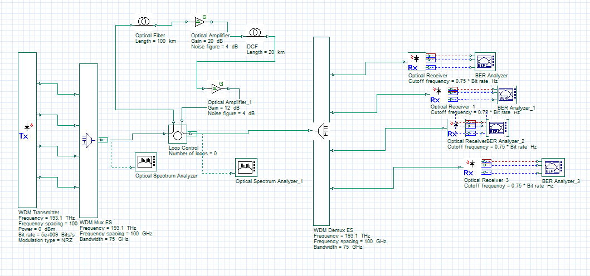

# 2.4 Tbps High-Speed DWDM System Simulation

A group project focused on the design, simulation, and performance analysis of
a high-speed Dense Wavelength Division Multiplexing (DWDM) system using OptiSystem.

The project focuses on a high-capacity DWDM configuration with Optical Inline
Amplifier (OA), Dispersion Compensating Fiber (DCF), Single-Mode Fiber (SMF),
and channel-wise BER and Q-factor analysis.

## System Overview

- 128-channel DWDM system
- High-speed target configuration up to 2.4 Tbps
- 100 km Single-Mode Fiber transmission link
- 20 km Dispersion Compensating Fiber
- Optical Inline Amplifier-based compensation
- Optical spectrum analysis
- BER and Q-factor evaluation
- Channel-wise performance analysis

## Main System Design


The component-level design includes the WDM transmitter, WDM multiplexer,
optical fiber, optical amplifiers, DCF, WDM demultiplexer, optical receivers,
and BER analyzers.

## OptiSystem Architecture



The main architecture combines optical amplification and dispersion
compensation to improve signal quality over the transmission link.

## Channel-wise Performance


The plot presents the Q-factor and BER behavior across the investigated
DWDM channels.

## Q-Factor Distribution


This distribution summarizes the Q-factor ranges obtained across the analyzed
channels.

## BER Distribution


This plot summarizes the BER distribution across different orders of magnitude.

## Key Components

- WDM transmitter
- WDM multiplexer
- Single-Mode Fiber
- Optical Inline Amplifier
- Dispersion Compensating Fiber
- WDM demultiplexer
- Optical receivers
- BER analyzers
- Optical spectrum analyzers

## Analysis Performed

- Channel scalability analysis
- BER performance evaluation
- Q-factor analysis
- Eye-diagram inspection
- Optical spectrum analysis
- Optical amplifier evaluation
- Dispersion compensation analysis
- Comparison between different system configurations

## Tools Used

- OptiSystem
- MATLAB or Python, if used for data processing
- GitHub for project documentation and version control

## Project Experience

This project provided practical experience in:

- DWDM system design
- Optical communication link configuration
- Optical amplifier placement
- Dispersion compensation
- BER and Q-factor interpretation
- Optical spectrum analysis
- Simulation result visualization
- Technical teamwork and project documentation

## Repository Structure

```text
assets/          Main system design images
results/         BER, Q-factor, and channel-wise plots
comparisons/     Alternative system configuration diagrams
simulation/      OptiSystem project files
```

## Contributors
This group project was completed by:
1. Md. Osman Goni
2. Arannamoy Mondal
3. Fabia Akter Borsha
